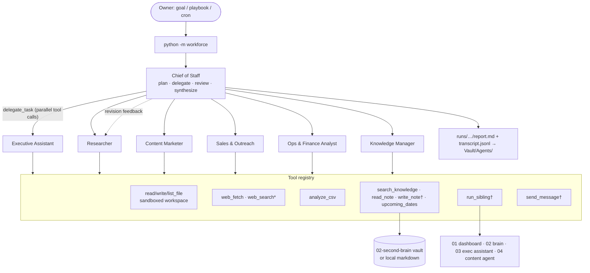

# 05 · AI Workforce

> A team of AI agents led by an AI **Chief of Staff**. You give it a goal; it plans the work,
> delegates to its specialists (in parallel where it can), reviews their work, sends weak drafts
> back for revision, and hands you one report with decisions and next actions.

The point is to buy back your time. You stop being the person who coordinates every task and
become the person who approves the results.

```bash
cd 05-ai-workforce
pip install -r requirements.txt            # anthropic + pytest; dry-run needs neither
python -m workforce run "Plan next week's content and outreach" --dry-run   # offline, no key
export ANTHROPIC_API_KEY=...               # or: ant auth login
python -m workforce run "Plan next week's content and outreach"
```

## Commands

| Command | What it does |
|---|---|
| `run "goal"` | The Chief of Staff plans, delegates, reviews and writes the report |
| `run --playbook launch-webinar --var topic="..."` | Runs a saved goal template from `playbooks/` |
| `ask <agent> "task"` | Gives a task to one agent directly, e.g. `ask researcher "..."` or `ask ops "..."` |
| `standup [--focus "..."]` | Daily routine: every specialist reports status in parallel, then the CoS proposes today's plan |
| `roster` | Lists the agents, their models and tools (approval-gated tools are marked), and the sibling CLIs |
| `history [--limit N]` | Lists past runs |
| `playbooks` | Lists playbooks and their variables |

Flags for `run`, `ask` and `standup`:
- `--dry-run` uses a scripted offline LLM. It makes no API calls and performs no side effects.
- `--yes` / `-y` auto-approves side-effect tools.
- `--quiet` / `-q` turns off the live progress output.

Each run writes to `runs/<timestamp>-<slug>/`:
- `report.md`: the final report, plus the delegation log and a usage/cost table
- `transcript.jsonl`: every request, response, tool call, tool result and approval decision
- `meta.json`: used by `history`

If `VAULT_PATH` is set, the report is also filed to `<vault>/Agents/YYYY-MM-DD-<slug>.md`. This is skipped in dry-run.

## Architecture


`†` = side effect, so it needs human approval and is skipped in dry-run. `*` = Claude's server-side web search, enabled with `enable_web_search = true` in the roster.

```
workforce/
  agent.py      Agent dataclass, the agent loop (tool use, max-turn guard, parallel tool calls),
                Usage (tokens + est. cost per agent), Transcript (JSONL)
  registry.py   Tool registry: Python function + JSON schema (generated from type hints), validation
  tools.py      Built-in tools (files, csv, web, knowledge, siblings, webhook)
  team.py       Team: Chief of Staff run, delegate_task, run_specialist, ask, standup
  knowledge.py  Second Brain adapter (sibling agent_api → local markdown fallback)
  safety.py     Approver (human-in-the-loop) + safe_path sandbox
  llm.py        AnthropicLLM (real API), ScriptedLLM (tests)
  dryrun.py     DryRunLLM: deterministic offline brain that drives the real orchestration code
  runs.py       run dirs, report rendering, history, vault export
  playbooks.py  goal templates
  config.py     roster.toml loader
```

**The agent loop** (`agent.run_agent`) is a manual Claude tool-use loop with no framework:
1. Call `messages.create` with the agent's system prompt, its tools and the history.
2. If `stop_reason == "tool_use"`, execute every `tool_use` block. When there are several, they run concurrently in a thread pool. All the `tool_result`s go back in a single user message.
3. Repeat until the model gives a final answer, or until `max_turns` is reached (the guard returns the last text with a note).

Other stop reasons:
- `pause_turn` (server-side web search) is resumed.
- `refusal` and `max_tokens` end the loop cleanly.

Tool exceptions, invalid inputs and unknown tools go back to the model as `is_error` results, so they never crash the run.

**Delegation** is a tool. The Chief of Staff calls `delegate_task(agent, task, context)`. Each call runs a fresh specialist loop and returns the deliverable as the tool result. When the CoS issues several delegations in one turn, they run in parallel (capped by `max_parallel`). To get a revision, the CoS calls the same agent again with feedback and the previous draft as `context`; the run log records the revision number.

**Live API details** (`llm.AnthropicLLM`):
- Default model is `claude-opus-5-5`. Override it with `CLAUDE_MODEL` or per agent with `model = "..."` in the roster.
- Adaptive thinking is the model default. Effort is set per agent (the CoS uses `effort = "high"`).
- `max_tokens=16000`.
- The server-side refusal fallback (`fallbacks="default"`, beta `server-side-fallback-2026-07-01`) is turned on for models that support it. Set `refusal_fallbacks = false` to turn it off.
- Usage is accumulated per agent, with a rough cost estimate from a built-in price table.

## The roster (`roster.toml`)

| Key | Agent | Does | Tools |
|---|---|---|---|
| `chief_of_staff` ★ | Chief of Staff | Breaks goals into tasks, delegates, reviews, synthesizes the report | delegate_task, search_knowledge, files, get_datetime, send_message† |
| `executive_assistant` | Executive Assistant | Calendar, inbox triage, priorities, deadlines | upcoming_dates, run_sibling† (exec-assistant, life-dashboard), files |
| `researcher` | Researcher | Market, competitor and ICP research with sources | web_fetch, web_search (flag), search_knowledge, files |
| `content_marketer` | Content Marketer | Content calendars, posts, emails, landing copy | search_knowledge, run_sibling† (content-agent), files |
| `sales_outreach` | Sales & Outreach | ICP, lead lists, outreach sequences, follow-ups | analyze_csv, files, search_knowledge, send_message† |
| `ops_analyst` | Operations & Finance Analyst | KPIs, revenue, margins and pipeline from CSVs | analyze_csv, list/read/write files |
| `knowledge_manager` | Knowledge Manager | Retrieves and files notes, decisions and SOPs in the Second Brain | search_knowledge, read_note, write_note†, upcoming_dates |

Put CSVs (e.g. `revenue.csv`, `leads.csv`) in `workspace/`, then try `run --playbook weekly-business-review`.

### Add an agent

Add a table to `roster.toml`. No code changes are needed:

```toml
[agents.customer_success]
name = "Customer Success"
role = "a customer success manager who keeps clients happy and spots upsells"
tools = ["search_knowledge", "analyze_csv", "write_file", "send_message"]
model = "claude-sonnet-5-5"   # optional per-agent override (e.g. a cheaper worker)
max_turns = 6
instructions = """Review accounts.csv, flag churn risks, draft check-in emails into cs/."""
```

The Chief of Staff sees new agents automatically, because its system prompt lists the roster.

### Add a tool

Register a typed Python function in `workforce/tools.py` (`build_registry`). The JSON schema is generated from the type hints and `params` descriptions. Add `ctx` as a parameter to get the workspace, the agent and the settings:

```python
@reg.tool(params={"ticker": "Stock symbol"}, side_effect=False)
def stock_price(ctx: ToolContext, ticker: str) -> dict:
    """Latest price for a ticker."""
    ...
```

Then list `"stock_price"` in an agent's `tools`. Set `side_effect=True` for anything that changes the outside world. That puts the tool behind the approval gate and makes dry-run skip it automatically. At startup the team checks that every tool named in the roster exists.

## Safety model

- **Sandboxed workspace.** `read_file`, `write_file`, `list_files` and `analyze_csv` resolve paths inside `workspace/`. Absolute paths, `..` and symlink escapes are rejected.
- **Human-in-the-loop for side effects.** These tools ask `Allow? [y/N]` on stdin before they run:
  - `write_note`: writes outside the workspace, into your vault
  - `send_message`: webhook
  - `run_sibling`: runs other programs

  Prompts are serialized across parallel workers. `--yes` auto-approves. With no TTY and no `--yes` (e.g. cron), the default is **deny**. When the human declines, the agent is told and continues without that tool.
- **Dry-run** never performs side effects and never prompts. Side-effect tools return `[dry-run] ... NOT executed`, and the transcript logs `side_effect_skipped`.
- **Sibling allowlist.** `run_sibling` can only run `python -m <module> <command>` for projects and commands listed under `[siblings.*]`. Shell metacharacters are rejected and there is no shell.
- **Bounded loops.** Every agent has `max_turns`, and workers cannot delegate, so there is no recursion. `max_parallel` caps concurrency.
- **Auditability.** Every model turn, tool call, result, approval and denial is recorded in `transcript.jsonl`.

## How it plugs into the other projects

Everything is loose coupling. If a sibling is missing, the workforce still runs.

| Project | Integration |
|---|---|
| `01-life-dashboard` | `run_sibling("life-dashboard", ["build"])`: the EA can rebuild the daily dashboard and briefing |
| `02-second-brain` | `search_knowledge`, `read_note`, `write_note` and `upcoming_dates` import `../02-second-brain/second_brain/agent_api.py` lazily at call time, passing `vault=$VAULT_PATH` when set. If it is absent, they fall back to a plain markdown search over `$VAULT_PATH` or `workspace/knowledge`. Set `WORKFORCE_KNOWLEDGE=local` to force the fallback. Run reports are filed to `<vault>/Agents/`. |
| `03-executive-assistant` | `run_sibling("exec-assistant", ["morning"\|"evening"\|"weekly"])` |
| `04-content-marketing-agent` | `run_sibling("content-agent", ["generate"\|"calendar"\|"repurpose"\|"review"\|"types", ...])` |

## Scheduling the daily standup

The standup is a fixed routine, which makes it cheap and predictable:
1. All specialists report status in parallel.
2. The Chief of Staff writes **Highlights / Blockers & decisions / Today's plan / Delegations queued**.

```cron
# weekdays 07:45 - report lands in runs/ (and your vault if VAULT_PATH is set)
45 7 * * 1-5  cd /path/to/05-ai-workforce && ANTHROPIC_API_KEY=... VAULT_PATH=~/Vault \
              /usr/bin/python3 -m workforce standup -q >> runs/cron.log 2>&1
```

Under cron there is no TTY, so side-effect tools are **denied** unless you add `--yes`. Only add it if you are comfortable with the team sending messages and running sibling CLIs unattended. A good pattern is to let the standup run without `--yes`, then act on the "decisions" section yourself. Weekly: `0 16 * * 5 ... -m workforce run --playbook weekly-business-review -q`.

## Tests

```bash
python -m pytest -q
```

The tests run offline. A `ScriptedLLM` emits scripted `tool_use` blocks, and the suite covers:
- schema generation and validation
- the agent loop, error results, the max-turn guard and `pause_turn`
- parallel tool calls (proved with a threading barrier)
- delegation from the CoS, including the revision round and parallel workers
- the approval gate (deny, allow, `--yes`, non-TTY, dry-run)
- the sandbox (`..`, absolute paths, symlinks)
- the Second Brain adapter: the sibling path and the fallback
- the request shape for the real API, using a fake SDK
- every CLI command end to end in dry-run
